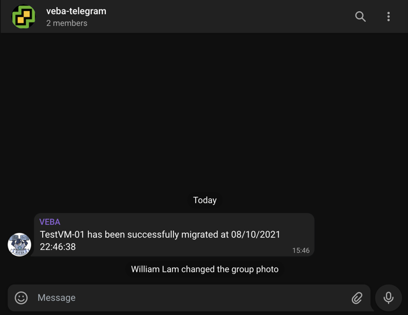

# kn-ps-telegram
Example Knative PowerShell function for sending to Telegram when a VM is migrated and also resides in a specific vSphere Resource Pool.



# Step 1 - Build


Create the container image locally to test your function logic.

```
docker build -t <docker-username>/kn-ps-telegram:1.0 .
```

# Step 2 - Test

Verify the container image works by executing it locally.

Change into the `test` directory
```console
cd test
```

Update the following variable names within the `docker-test-env-variable` file

* TELEGRAM_BOT_API_KEY - Telegram Bot API key
* TELEGRAM_GROUP_CHAT_ID - Telegram Group Chat ID
* VCENTER_RESOURCE_POOL_FILTER - Name of vSphere Resource Pool to filter for and only sent Telegram if migrated VM is located in RP
* VCENTER_SERVER - IP Address or FQDN of the vCenter Server to connect to check for parent vSphere Resource Pool
* VCENTER_USERNAME - vCenter account with permission to check for parent vSphere Resource Pool
* VCENTER_PASSWORD - vCenter credentials to account with permission to check for parent vSphere Resource Pool
* VCENTER_CERTIFCATE_ACTION - Set-PowerCLIConfiguration Action to configure when connection fails due to certificate error, default is Fail. (Possible values: Fail, Ignore or Warn)

Start the container image by running the following command:

```console
docker run -e FUNCTION_DEBUG=true -e PORT=8080 --env-file docker-test-env-variable -it --rm -p 8080:8080 <docker-username>/kn-ps-telegram:1.0
```

In a separate terminal, run either `send-cloudevent-test.ps1` (PowerShell Script) or `send-cloudevent-test.sh` (Bash Script) to simulate a CloudEvent payload being sent to the local container image

```console
Testing Function ...
See docker container console for output

# Output from docker container console
08/11/2021 14:45:44 - PowerShell HTTP server start listening on 'http://*:8080/'
08/11/2021 14:45:44 - Processing Init

08/11/2021 14:45:44 - Configuring PowerCLI Configuration Settings

08/11/2021 14:45:45 - Connecting to vCenter Server vcsa.primp-industries.local

08/11/2021 14:46:15 - Successfully connected to vcsa.primp-industries.local

08/11/2021 14:46:15 - Init Processing Completed

08/11/2021 14:47:33 - DEBUG: K8s Secrets:
{"TELEGRAM_BOT_API_KEY": "XXXXXX","TELEGRAM_GROUP_CHAT_ID": "XXXXXX","VCENTER_RESOURCE_POOL_FILTER": "Customer-A","VCENTER_SERVER": "vcsa.primp-industries.local","VCENTER_USERNAME" : "administrator@vsphere.local","VCENTER_PASSWORD" : "XXXXXX","VCENTER_CERTIFICATE_ACTION" : "Ignore"}

08/11/2021 14:47:33 - DEBUG: CloudEventData

Name                           Value
----                           -----
FullFormattedMessage           Virtual machine TestVM-01 was migrated from host 192.168.30.101, vsanDatastore in …
Dvs
Net
UserName                       VSPHERE.LOCAL\Administrator
Datacenter                     {Name, Datacenter}
CreatedTime                    08/10/2021 18:20:24
ChainId                        5636613
SourceHost                     {Name, Host}
SourceDatacenter               {Name, Datacenter}
ComputeResource                {Name, ComputeResource}
Ds                             {Name, Datastore}
Template                       False
SourceDatastore                {Name, Datastore}
Key                            5636626
ChangeTag
Vm                             {Name, Vm}
Host                           {Name, Host}


08/11/2021 14:47:33 - Creating VM MoReF
08/11/2021 14:47:33 - Retreiving parent Resource Pool
08/11/2021 14:47:33 - Sending message to Telegram ...
08/11/2021 14:47:33 - DEBUG: Telegram URL:
	https://api.telegram.org/botXXXXXX/sendMessage

08/11/2021 14:47:33 - DEBUG: Telegram Message:
	TestVM-01 has been successfully migrated at 08/10/2021 18:20:24

08/11/2021 14:47:34 - Successfully sent Telegram message ...
```

# Step 3 - Deploy

> **Note:** The following steps assume a working Knative environment using the
`default` Rabbit `broker`. The Knative `service` and `trigger` will be installed in the
`vmware-functions` Kubernetes namespace, assuming that the `broker` is also available there.

Push your container image to an accessible registry such as Docker once you're done developing and testing your function logic.

```console
docker push <docker-username>/kn-ps-telegram:1.0
```

Update the `telegram_secret.json` file with the required Telegram and vCenter Server configurations and then create the kubernetes secret which can then be accessed from within the function by using the environment variable named called `TELEGRAM_SECRET`.

```console
# create secret

kubectl -n vmware-functions create secret generic telegram-secret --from-file=TELEGRAM_SECRET=telegram_secret.json

# update label for secret to show up in VEBA UI
kubectl -n vmware-functions label secret telegram-secret app=veba-ui
```

Edit the `function.yaml` file with the name of the container image from Step 1 if you made any changes. If not, the default VMware container image will suffice. By default, the function deployment will filter on the `VmMigratedEvent` vCenter Server Event. If you wish to change this, update the `subject` field within `function.yaml` to the desired event type.


Deploy the function to the VMware Event Broker Appliance (VEBA).

```console
# deploy function

kubectl -n vmware-functions apply -f function.yaml
```

For testing purposes, the `function.yaml` contains the following annotations, which will ensure the Knative Service Pod will always run **exactly** one instance for debugging purposes. Functions deployed through through the VMware Event Broker Appliance UI defaults to scale to 0, which means the pods will only run when it is triggered by an vCenter Event.

```yaml
annotations:
  autoscaling.knative.dev/maxScale: "1"
  autoscaling.knative.dev/minScale: "1"
```

# Step 4 - Undeploy

```console
# undeploy function

kubectl -n vmware-functions delete -f function.yaml

# delete secret
kubectl -n vmware-functions delete secret telegram-secret
```